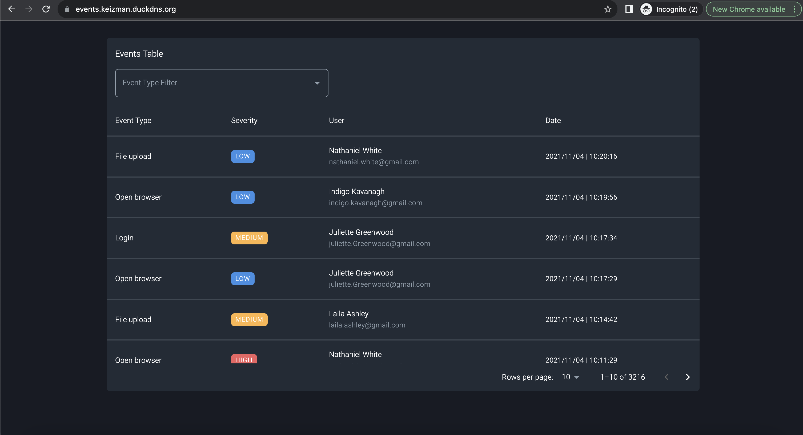
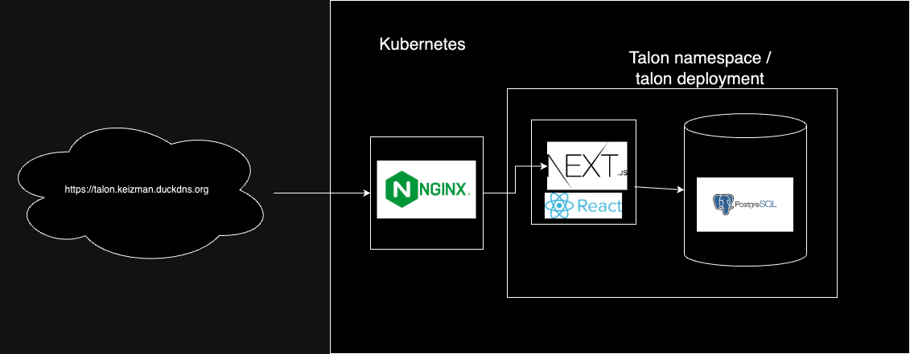

# Talon Fullstack interview solution

This project contains my solution for [Talon Security FS home assignment](./talon_fullstack_assignment/).

Online demo: https://events.keizman.duckdns.org

## Project Overview

- [Next.js](https://nextjs.org/) & React - FS application and SSR
- [Sequlize](https://sequelize.org/) - ORM
- [Postgres](https://www.postgresql.org/) - store application state

I decided to implement this challenge using Next.js. First of all because it suites the problem, but mostly because I never had the chance to use this technology and this is a great opportunity to do so. Next.js gives a fast and easy start up to build FS applciations with SSR capabilities and many more. It gives you one project to rule them all (FE and BE), easy way to share types between BE/FE, however it requires a shift in the way we think on React components with the definition of server component and hydration.

- [app](./src/app/) - Server main router
  - [api](./src/app/api) - Server /api router, contains REST API
  - [page](./src/app/page.tsx) - App root component
- [components](./src/components/) - Server and client components
- [events](./src/events/) - Events modules, contains models (orm definitions) and service ( data access functions)
- [migrations](./src/migrations/) - Migration for managin schema changes and seeds

## Running the project

- `$ docker compose up`
- Acces UI at: `http://localhost:3000`

# Todo

- Make the ui responsive.
- Add tests.

# Deploying using helm

- `$ cd chart`
- `$ helm dep build`
- `$ helm upgrade --install events . --set secrets.POSTGRES_PASSWORD=test123 --set secrets.POSTGRES_HOST=events-postgresql --set secrets.POSTGRES_USER=postgres --set secrets.POSTGRES_DBNAME=talon --set postgresql.auth.postgresPassword=test123`
